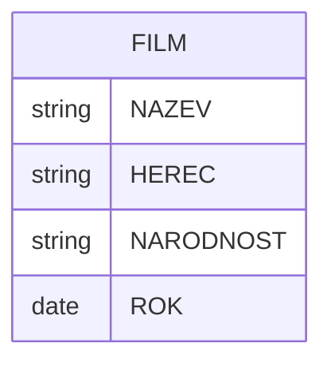
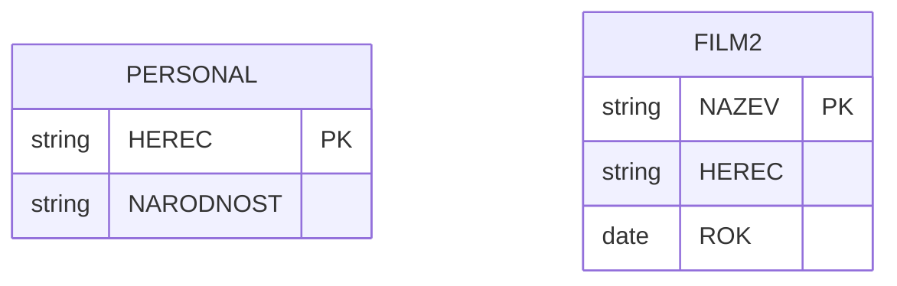

# Bezztrátová dekompozice
> [!note]
> Výsledná schémata by měla mít stejnou sémantiku a relace by měly obsahovat stejná data, jaká obsahovala původní relace.
## Dekompozice vs Syntéza
> [!info] Dekopozice
Dělíme původní relace na více schémat.

> [!info] Syntéza
> Každý atribut zvlášť, dle Armstrongových pravidel  slučujeme do tabulek.

## Zachování sémantiky
Sémantika schématu je dána pomocí integritních omezení (IO), která jsou vyjádřeny (nejen) pomocí funkčních závislostí (FZ).

## Příklad

Provedeme dekompozici do 3NF:
