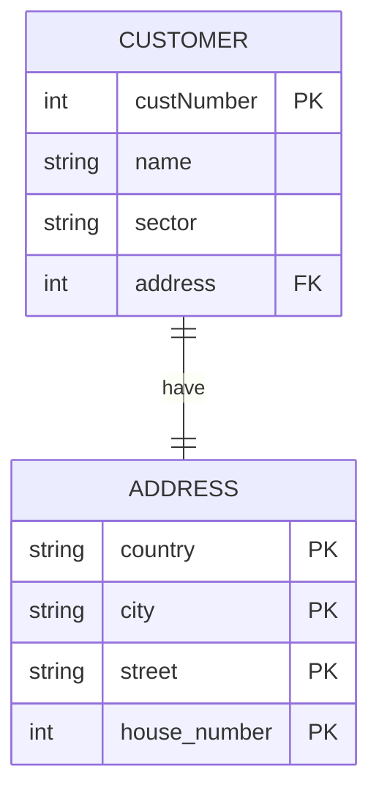
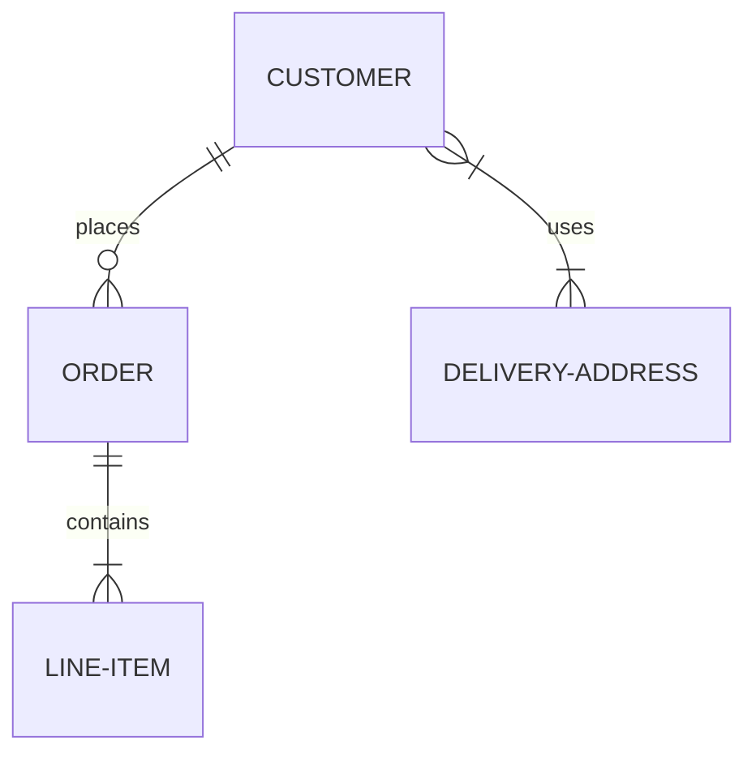

#SQL
# Modelování relačního modelu pomocí UML
**ER diagram** = **ERD** = vztahový model (entity relationship diagram), nebo E-R (entitně relační) model, používaný v softwarovém inženýrství i pro modelování databází; konceptuální zobrazení dat; obrázek je podobný vývojovému diagramu. 

Blíže o [[RMD - Relační model dat|relačním modelu dat]]. 

![[Přehled notací konceptuality.PNG]]

## Modelování entit a relací
[[RMD - Relační model dat#Základní pojmy|Základní pojmy]]:
- **entita**  - věc která je středem zájmu, ke které chceme sbírat data,
- **entitní množina** - množina entit téhož typu, které sdílí stejné vlastnosti či atributy,
- **atribut** - vlastnost entity, která nás v daném kontextu zajímá a jejíž hodnotu chceme znát,
- **doména atributu** - množina přípustných hodnot atributu.

### Atributy 
Každý [[RMD - Relační model dat#Atribut|atribut]] leží na svém řádku. Popisuje určuje jej:
- datový typ,
- název,
- "klíčovost" atributu,
- případně povinnost vyplnění (NULL/NN).

### Relace 
Relace neboli [[RMD - Relační model dat#Vztah|vazby]] jsou běžně značená slovesem nad čárou propojující tabulky. Relaci zaznamenáváme do modelu pomocí klíčů. Klíče se dělí na:
- PK - privátní klíč, je unikátní (popisuje danou entitu, ID).
- FK - cizí klíč, je to atribut tabulky, jenž vytváří relaci. Specifikuje přesně s kterým jiným záznamem je daná entita propojena. 

## Kardinalita a parcialita
Další informace jsou nalezení v [[RMD - Relační model dat#Integrita databáze a integritní omezení|integritních omezení]].

#### Kardinalita vztahu
Dělí se na:
- 1:1 – (značíme `| -- |` ) vztah, ve kterém na obou stranách vystupuje pouze jeden objekt dané entity (např. vztah manželé mezi entitou muž a entitou žena);
- 1:N – (značíme `| -- {` ) ne jedné straně je jediný objekt, který je ve vztahu s jedním nebo více objekty na straně druhé. Jedná se o typ, který se vyskytuje velmi často (např. oddělení a zaměstnanec); 
- M:N – (značíme `} -- {`, "vidličky" ) vztahy, kde vystupuje více objektů na obou stranách (např. zaměstnanec a úkol, kde jeden úkol může řešit více zaměstnanců a současně jeden zaměstnanec může řešit více úkolů).

Pokud tvoříme vazbu 1:N, tak *FK* je vždy uložen v entitě na straně 1!

Pokud tvoříme vazbu M:N, tak potřebujeme vytvořit ještě jednu vazební tabulku, jejíž atributy budou tvořit postupně oba *FK*, *FK* (případně zde mohou být jiné atributy, jako například časová značka, nebo hodnota).

#### Parcialita
Vyjadřuje povinnost či nepovinnost existence role příslušné entity ve vztahu. V UML digramech se parcialita značí buď: 
- `o` - kolečkem jako nepovinný vztah, ani jeden prvek nemusí být (O).
- `|` - svyslítkem jako povinný vztah, alespoň jeden prvek musí být (1).

### Kardinalita a parcialita vykreslená pomocí Mermaid

| Množství (vlevo) | Množství (vpravo) | Význam          |
| ---------------- | ----------------- | --------------- |
| `\|o`            | `o\|`             | Nula nebo jeden |
| `\|`             | `\|`              | Právě jeden     |
| `}o`             | `o{`              | Nula nebo více  | 
| `}\|`            | `\|{`             | Jeden nebo více |

## Zdroje:
- https://mermaid.js.org/syntax/entityRelationshipDiagram.html
