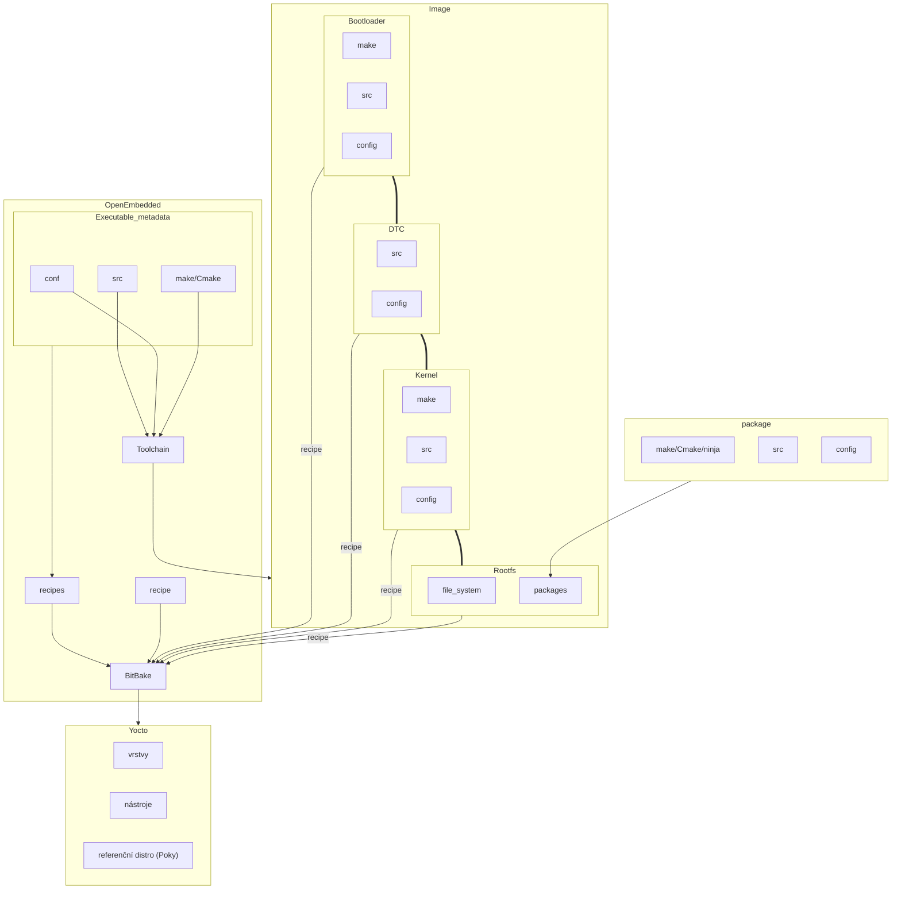

# Yocto
Stojí nad BitBake.

## Dokumentace

Černá dokumentace je aktuální.
### Struktura dokumentace

What I wish to know about Yocto
Overview and concepts
- Kde začít

Board Support Package
- Jak to rozchodit na naší desce

Development tasks manual
BitBake Documentation

Toaster -> grafických náhled přes web na buildovací server

## Konfigurace
See the [local.conf.sample](https://git.yoctoproject.org/poky/tree/meta-poky/conf/templates/default/local.conf.sample) in the `meta-poky` layer:
- _Target Machine Selection:_ Controlled by the [MACHINE](https://docs.yoctoproject.org/ref-manual/variables.html#term-MACHINE) variable.
- _Download Directory:_ Controlled by the [DL_DIR](https://docs.yoctoproject.org/ref-manual/variables.html#term-DL_DIR) variable.
- _Shared State Directory:_ Controlled by the [SSTATE_DIR](https://docs.yoctoproject.org/ref-manual/variables.html#term-SSTATE_DIR) variable.
- _Build Output:_ Controlled by the [TMPDIR](https://docs.yoctoproject.org/ref-manual/variables.html#term-TMPDIR) variable.
- _Distribution Policy:_ Controlled by the [DISTRO](https://docs.yoctoproject.org/ref-manual/variables.html#term-DISTRO) variable.
- _Packaging Format:_ Controlled by the [PACKAGE_CLASSES](https://docs.yoctoproject.org/ref-manual/variables.html#term-PACKAGE_CLASSES) variable.
- _SDK Target Architecture:_ Controlled by the [SDKMACHINE](https://docs.yoctoproject.org/ref-manual/variables.html#term-SDKMACHINE) variable.
- _Extra Image Packages:_ Controlled by the [EXTRA_IMAGE_FEATURES](https://docs.yoctoproject.org/ref-manual/variables.html#term-EXTRA_IMAGE_FEATURES) variable.
## Layers
- [Managing Layers](https://docs.yoctoproject.org/dev-manual/layers.html#managing-layers)

### Recepts
recepty:
`.class` - dědíme přes INHERIT
`.bb` - bitbake recept
`.bbappend` - najdi stejnojmenný recept a tohle přidej
`.conf` - konfigurace

### OpenEmbedded Build System Concepts

## Další

VisualStudio Code rozšíření

BitBake
- Fatcher - stahování zdrojáků

