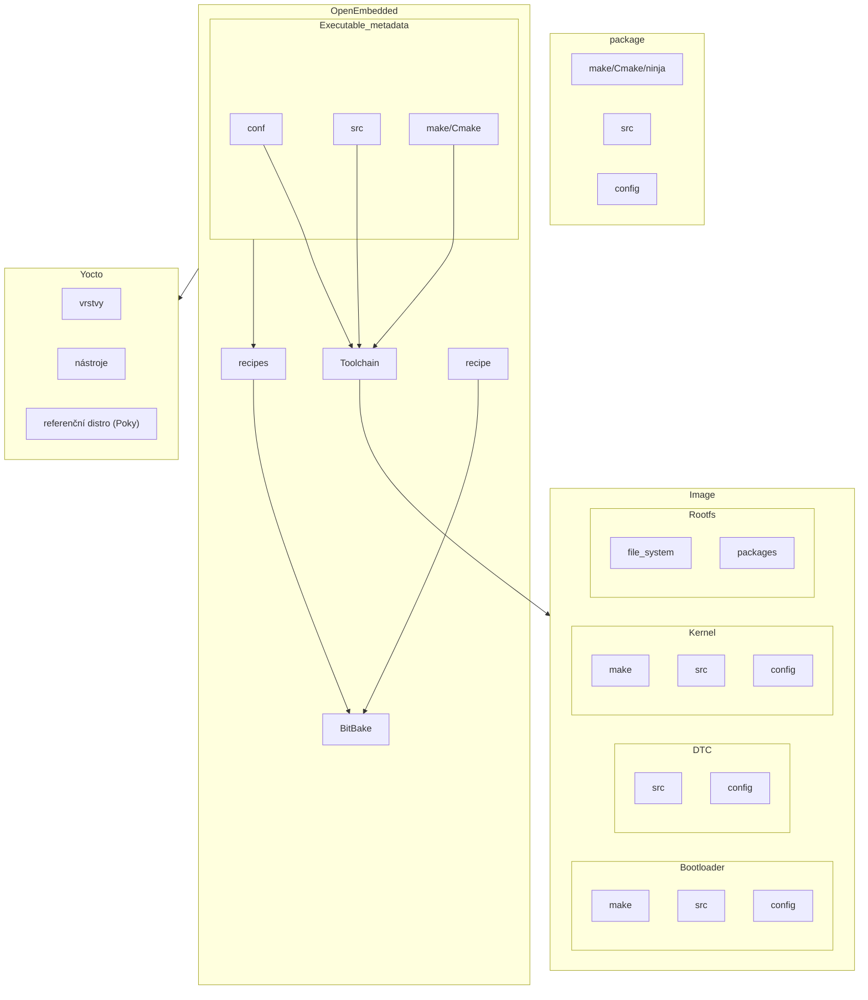

# Yocto
Stojí nad BitBake.

## Dokumentace

Černá dokumentace je aktuální.
### Struktura dokumentace

What I wish to know about Yocto
Overview and concepts
- Kde začít

Board Support Package
- Jak to rozchodit na naší desce

Development tasks manual
BitBake Documentation

Toaster -> grafických náhled přes web na buildovací server

## Další

recepty:
`.class` - dědíme přes INHERIT
`.bb` - bitbake recept
`.bbappend` - najdi stejnojmenný recept a tohle přidej
`.conf` - konfigurace

VisualStudio Code rozšíření

BitBake
- Fatcher - stahování zdrojáků