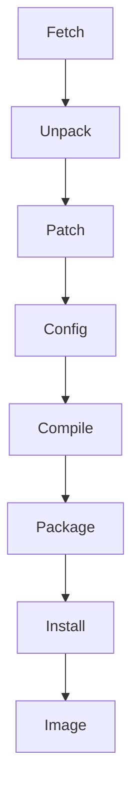

# rootfs

## binárky
Co nepřidáme to nemáme. Balíčky běžných aplikací.
- openshh
- lib
- bin
	- POSIX

### Jak získat zdrojáky?

1) Fetch
   - wget
   - git
   - cus
   - svm

2) Unpack
3) Patch
4) Configure
5) Compile
   - Yocto
6) Package
   - .deb, 
   - .rpm
7) Install
8) Image
   - zabalený a kopírovatelný do paměti

`make clean` - zahodí vše za configure
`make distclean` - zahodí vše od Patch

## BusyBox
Jeden zdroják pro všechny příkazy.

## Další
- output
	- images
		- rootfs
		- kernel
		- device_tree
		- u-boot
		- start-gemu.sh