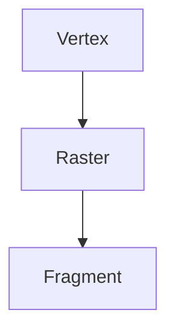

# 3D Grafika
> [!info] Qualcom grafiky:
ADRENO -> RADEON

## Zkratky
- DSA - Direct State Access
- VAO - Vertex Array Object
- VBO - 
- EBO - 
- GLSL - OpenGL Shading Language
- HLSL - High Level Shading Language

## Základní pojmy
![[Základní pojmy počítačové grafiky|Základní pojmy]]

## Ovladače
- DirectX
- OpenGL
	- multiplatformní
- Vulcan
	- multiplatformní
	- složité

> [!info] Ovladače grafické karty kompilují naše shadery: 
>- GLSL
>- HSLS
>- Vulcan
>- ...
## OpenGL
![[OpenGL]]

## GPU pipeline zpracování obrazu

![[graphics-pipeline.png]]



## Textury

MIPMAP

## Vykreslovaná objektů podle hloubky
![[Vykreslovaná objektů podle hloubky]]


Jak zajistit aby se věci includovali jenom jednou?

Na win:
```C
#pragma once
```

Platformě nezávislé:
```C
#ifnotdef _MY_HPP_
#define _MY_HPP_
#include <...>
#endif
```