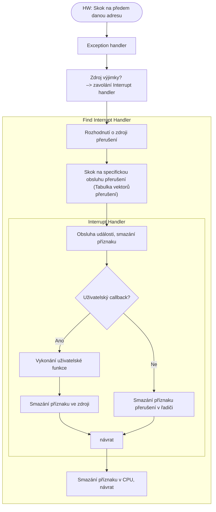

# Obsluha periferií

## polling

Aktivní kontrola stavu periferie.

![[polling.jpg]]

Model obsluhy v nekonečné smyčce:
### A)
Kontrola periferie0→ akce0
Kontrola periferie1→ akce1
…

### B)
Kontrola periferie0, perfierie1..N
Dle stavu akce0, akce1…N

> [!question] K zamyšlení:
Využití CPU, priority, výpočty mimo obsluhu

## přerušení, výjimka

Kontrola periferie vyvolána událostí.

> [!example] Termíny
>- Exception – výjimka – událost uvnitř CPU
>- Interrupt – přerušení – žádost o obsluhu vyvolaná změnou stavu ext. signálu
>- Handler – obsluha – obsluhující funkce
>- Interrupt vector table - tabulka vektorů přerušení – adresy funkcí obsluh
>- Callback – kólbek – uživatelská funkce
>- IRQ – Interrupt Request – Identifikátor přerušení

CPU – podpora zpravidla 1-2 signály přerušení

> [!question] K zamyšlení:
Přerušení v přerušení, moc přerušení