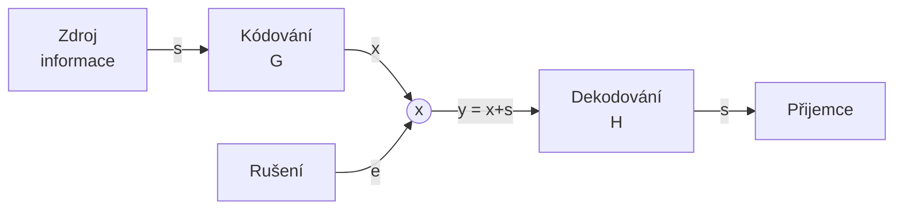

# Lineární kódy
Prostředky lineární algebry. Kódová slova vnímáme jako vektory v n-rozměrném prostoru. 
Vše je modulo 2.
```
0+0 = 0
0+1 = 1
1+0 = 1
1+1 = 0

0*0 = 0
0*1 = 0
1*0 = 0
1*1 = 1
```

![[images_plus_krát.png]]

Lineární množina M
$a,b \in M$ 
$a+b \in M$
Součet kódových slov je kódové slovo. 0 je vždy kódové slovo.
Kódy blokové.

## Terminologie lineárních kódů
[[Kód(3,1)]]
kód(7,4)

Kód(n,k)
- $n$ - délka kódového slova
- $k$ - počet informačních bitů
- $n-k$ - počet zabezpečovacích bitů

Posloupnosti bitů = vektory




Odesilatel:
$\vec s = \left\{0,1 \right\}^k$ - informace vyslaná
$\vec x = \left\{0,1 \right\}^n$ - kódové slovo
$\vec x = \vec s * G$
- $G$ - generující matice

Příjemce:
$\vec y$ - vektor n bitů - obdržená zpráva 
$H * \vec y^T =? \vec O$
- $H$ - kontrolní matice
-  $n-k$ - řádků
- $n$ - sloupců


Vztah $G$ a $H$
$G - k*n$
$H - (n-k)*n$

$H*G^T = 0$
$G = (E_k - B^T)$
$H = (B*E_{n-k})$

### Příklad
Zpráva: 110 001 111
$\vec s_1 = 110$
$\vec s_2= 001$
$\vec s_3 = 111$

G = 
1001
0101
0011

$$
\vec x = \vec s_1 * G = (110) (...) = (1100)
$$
$$
\vec x = \vec s_2 * G = (001) (...) = (0011)
$$
$H = (1111)$

$\vec y_1 = (1100)$
$\vec y_2 = (1011)$

$$H * \vec y_1 = (1111)*(1100)^T = 2 \pmod 2 =0$$
$$H * \vec y_2 = (1111)*(1011)^T = 3 \pmod 2 = 1 \rightarrow chyba$$
### Příklad 2:
Volební [[Kód(3,1)]]
G = (111)

$$
H = 
\begin{pmatrix}  
1 & 1 & 0\\  
1 & 0 & 1  
\end{pmatrix}
$$

$$\vec s_1 = 0 ; x_1 = 0*(111) = (000)$$
$$\vec s_2 = 1 ; x_2 = 1*(111) = (111)$$

$\vec y_1 = (000)$
$\vec y_2 = (101)$

$$
\begin{pmatrix}  
1 & 1 & 0\\  
1 & 0 & 1  
\end{pmatrix}
* (000) = \vec 0
$$
$$
\begin{pmatrix}  
1 & 1 & 0\\  
1 & 0 & 1  
\end{pmatrix}
* (101) = (1,0) \neq \vec 0
$$


## Hammingovská vzdálenost
![[Hammingovská vzdálenost]]

## Lineární kódy se schopností opravy chyb
![[Lineární kódy se schopností opravy chyb]]