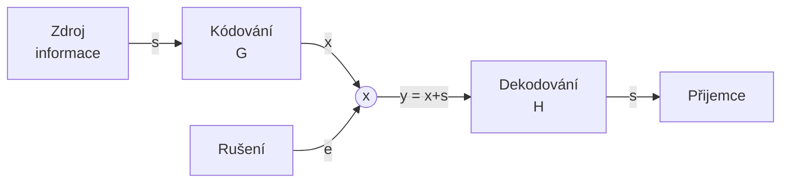

# Lineární kódy
Prostředky lineární algebry. Kódová slova vnímáme jako vektory v n-rozměrném prostoru. 
Vše je modulo 2.
```
0+0 = 0
0+1 = 1
1+0 = 1
1+1 = 0

0*0 = 0
0*1 = 0
1*0 = 0
1*1 = 1
```

![[images_plus_krát.png]]

Lineární množina M
$a,b \in M$ 
$a+b \in M$
Součet kódových slov je kódové slovo. 0 je vždy kódové slovo.
Kódy blokové.

## Terminologie lineárních kódů
Například kódy:
- [[Kód(3,1)]]
- [[Kód(7,4)]]

Značení: $Kód(n,k)$
- $n$ - délka kódového slova
- $k$ - počet informačních bitů
- $n-k$ - počet zabezpečovacích bitů

Posloupnosti bitů = vektory




Odesilatel:
$\vec s = \left\{0,1 \right\}^k$ - informace vyslaná
$\vec x = \left\{0,1 \right\}^n$ - kódové slovo
$\vec x = \vec s * G$
- $G$ - generující matice

Příjemce:
$\vec y$ - vektor n bitů - obdržená zpráva 
$H * \vec y^T =? \vec O$
- $H$ - kontrolní matice
-  $n-k$ - řádků
- $n$ - sloupců


Vztah $G$ a $H$
$G - k*n$
$H - (n-k)*n$

$H*G^T = 0$
$G = (E_k - B^T)$
$H = (B*E_{n-k})$

### Příklad 1:
![[Lineární kódy příklad]]
### Příklad 2:
![[Kód(3,1) příklad]]

## Hammingovská vzdálenost
![[Hammingovská vzdálenost]]
