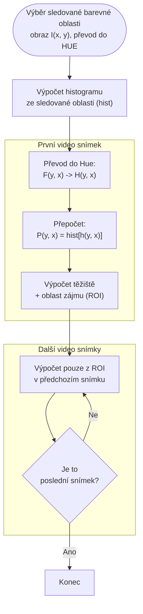

# Camshift

1. Výběr sledované barevné oblasti -> obraz I(x, y), převod do HUE
2. Výpočet histogramu ze sledované oblasti -> hist
3. První video snímek:
	1. F(y, x) -> převod do Hue: H(y, x) -> přepočet: $P(y, x) = hist[h(y, x)]$
	2. výpočet těžiště + oblast zájmu (ROI)
4. Další video snímky: 
	1. Výpočet jen z oblast zájmu (ROI) v předchozím snímku

