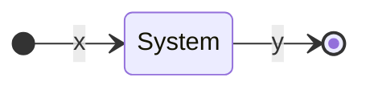

# Filtrace
## Různé vlastnosti filtrů:

### Stabilní filtr
Pro omezený vstup má omezený výstup.

### Kauzální filtr
Musí mít odezvu směrem doprava. Tedy když nepotřebuje žádné vzorky z budoucnosti!

Například: 
![[Klouzavý průměr]]

### Filtry s lineární fází 
> [!tip] Filtry s lineární fází 
> Neupravují signál, pouze jej posouvají v čase.
## Metody popisu filtru:
> [!warning] Metody popisu:
>- diferenční rovnicí
>- v časové oblasti
>- ve frekvenční oblasti 

> [!tip]
V časové oblasti: [[Konvoluce|konvoluce]], ve frekvenční násobení.



### Diferenční rovnicí
> [!important]
$$
y[n] = \sum_{k=0}^q b[k]x[n-k] - \sum_{k=1}^p a[k]y[n-k]
$$
- $a$ - koeficienty $y$
- $b$ - koeficienty $x$

> [!note]
> Druhá suma začíná na index $1$ jelikož $0$ člen je na levé straně rovnice.
> Obdobně druhou lineární kombinaci odčítáme od té první protože jsme ji přesunuli z leva.  

Diferenční rovnice -> výstup z filtru
1. Numerická (Dosadíme za $n$, `filter`)
2. Analytická (DFT, teorém o posunutí, `conv`, `filter`)

>[!tip] Teorém o posunutí
$x[n] -> X(e^{j\omega})$
$x[n-n_0] -> X(e^{j\omega})*e^{-j\omega n_0}$

>[!example]
$X(e^{j\omega})$
>- $\omega \in R [-]$ - [[Digitální frekvence|digitální frekvence]], $\omega \in (0, \pi)$
>- $f \in R [Hz]$ - [[Analogová frekvence|analogová frekvence]]
>
>$\omega = 2\pi*\frac{F}{F_s}$ 
>- $\omega = \pi$
>
>$F = F_s/2$

### V časové oblasti pomocí [[Konvoluce|konvoluce]]:
$$
y[n] = \sum_{k=-\infty}^{\infty} h[k]x[n-k]
$$

### Ve [[Furierova transformace|frekvenční]] oblasti:
$$
Y(e^{j\omega}) = H(e^{j\omega})X(e^{j\omega})
$$

### V [[Z-transformace|Z]] oblasti:
$$
Y(z) = H(z)X(z)
$$

## Typy filtrů
- [[FIR - Finite Impulse Response]]
- [[IIR - Infinite Impulse Response]]

### FIR
Lze realizovat za pomoci konvoluce.
- [[Filtry FIR příklady]]
### IIR
- [[Filtry IIR příklady]]

## Inverzní filtr
$$
x[n] * h[n] * g[n] = x[n] = x[n] * \delta[n]
$$

$$
h[n] * g[n] = \delta[n]
$$

### Ve frekvenční oblasti:
$$
H(e^{j\omega})G(e^{j\omega}) = 1
$$

$$
G(e^{j\omega}) = \frac{1}{H(e^{j\omega})}
$$
> [!warning]
> Nemá smysl pro $H = 0$, tedy tam kde se nám frekvence nulují.

> [!tip]
> V praxi nám stačí prohodit koeficienty `A` a `B`, při tvorbě filtru.

> [!info]
> K FIR je inverzní k IIR a naopak.

## Příklady filtrů

Allpass filter
- pracuje jen s fází

### Frekvenčně selektivní filtry
> [!example] Frekvenčně selektivní filtry
>- Dolní propust
>- Pásmová propust
>- Pásmová zádrž
>- Horní propust

### Filtry s lineární fází
Impulzní odezva musí být:
- konečná,
- sudě symetrická.

Když filtr propouští signál, tak mu nic nedělá.

## Spojení filtrů
![[Spojení filtrů]]

## Decibely
![[Decibely]]

## Toleranční schéma
Pro frekvenční filtry.

> [!info]
> Přechodové pásmo - nechtěný parametr (mělo by být co nejužší)

> [!tip]
Vícepásmový filtr - ekvalizér
(paralelní zapojení pásmových propustí)

DTFT:
Posunutí o necelé číslo:

$x[n] -> X(e^{j\omega})$

$x[n-n_0] -> X(e^{j\omega})*e^{-j\omega*n_0}$
- $n_0 = 1,5$ 
$\sum_{n=-\infty}^{\infty}$ 
$x[n]*$

$$
y[m] = \sum_{n=-\infty}^{\infty} 
x[n]*sinc(n-m-n_0)
$$
- sinc interpolace
$$
\sum_{n=-\infty}^{\infty} 
x[n]*y[n-m]
$$
- fractional delay


## Návrh filtrů FIR

- [[Notch filtr]]
- [[Peeking filtr]]

### Použití filtrů:
```matlab
% filtr
y = filter(h, 1, x);
```
- a - y
- b - x

```matlab
% konvoluce
y = conv(h, x, 'same');
```

Jak získáme $h$?

### Metoda oken
![[Návrh filtrů metodou oken]]

### Metoda nejmenších čtverců
![[Návrh filtrů metodou nejmenších čtverců]]

### Filtr se stejnoměrným zvlněním
![[Návrh filtrů se stejnoměrným zvlněním]]

### Vzorkování frekvenční charakteristiky
1. Navrozkujeme frekvenční charakteristiku.
2. Povolíme přechodové pásmo.
3. Přidáme okénko.
```
[1 1 0.5 0 0 0 0]
```

Umožňuje navrhnout i pásmové filtry.

## Návrh IIR
> [!done] Výhody
>- Významně menší řád filtrů.

> [!warning] Riskujeme: 
>- nestabilitu.
>- nelineární fázi.

> [!info] Navrhujeme pomocí:
> Diskretizací analogového filtru.
> - Laplaceova transformace (protějšek Z-transformace).

### Butterworthův filtr
Má široké přechodové pásmo.

### Návrh v Matlabu
Matlab:
`filterDesigner`

Řád filtru:
- $(order+1)*2 =$ počet koeficientů

Uložení navrženého filtru:
file -> export ->

Načtení exportovaného filtru do matlabu:
`load('nazev_filtru.mat', 'b')`

## Srovnání filtrů

| FIR                                             | simple? | order                    | arbitrary magnitude | Determ. |
| ----------------------------------------------- | ------- | ------------------------ | ------------------- | ------- |
| [[Návrh filtrů metodou oken\|Window]]           | ✔       | $\uparrow$$\uparrow$     | ✘                   | ✔       |
| [[Návrh filtrů metodou nejmenších čtverců\|LS]] | ~       | $\uparrow$               | ✔                   | ✘       |
| [[Návrh filtrů se stejnoměrným zvlněním\|Eqr]]  | ~       | $\uparrow$               | ✔                   | ✔       |
| **IIR**                                         | ~       | $\downarrow$$\downarrow$ |                     |         |
| Butter                                          |         | $\downarrow$             | ✘                   | ✔       |
| Eliptic                                         |         | $\downarrow$$\downarrow$ | ✘                   | ✔       |

## Optimální filtry
Využití trénovacích signálů.

Target Cancellation Filters
