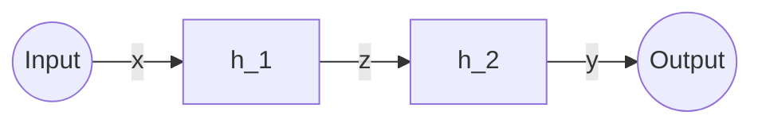
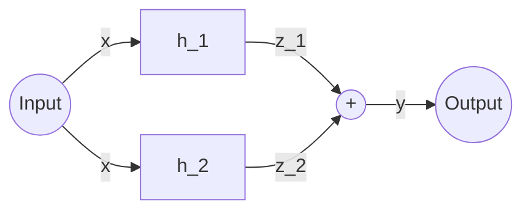
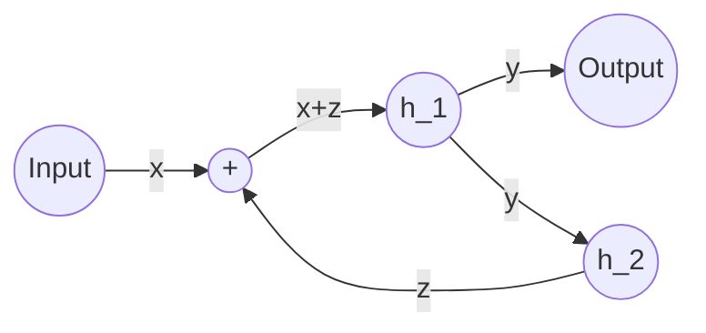

# Spojení filtrů
> [!example]
>- Sériové,
>- Paralelní, 
>- Zpětná vazba.

## Sériové

$$
y[n] = h_1 * h_2 * x
$$

$$
Y(e^{j\omega}) = H_1(e^{j\omega})H_2(e^{j\omega})X(e^{j\omega})
$$

$$
H(e^{j\omega}) = H_1(e^{j\omega})H_2(e^{j\omega})
$$

Frekvenční komponenta musí ležet v propustném pásmu obou filtrů.
## Paralelní

$$
y[n] = h_1 * x + h_2 * x
$$

$$
Y(e^{j\omega}) = H_1(e^{j\omega})X(e^{j\omega}) + H_2(e^{j\omega})X(e^{j\omega})
$$

$$
H(e^{j\omega}) = H_1(e^{j\omega}) + H_2(e^{j\omega})
$$

Frekvenční komponenta musí ležet v propustném pásmu alespoň jednoho z filtrů.

## Zpětná vazba

Používá se u řízení.

$$
H(e^{j\omega}) = \frac{H_1(e^{j\omega})}{1 - H_1(e^{j\omega})*H_2(e^{j\omega})}
$$