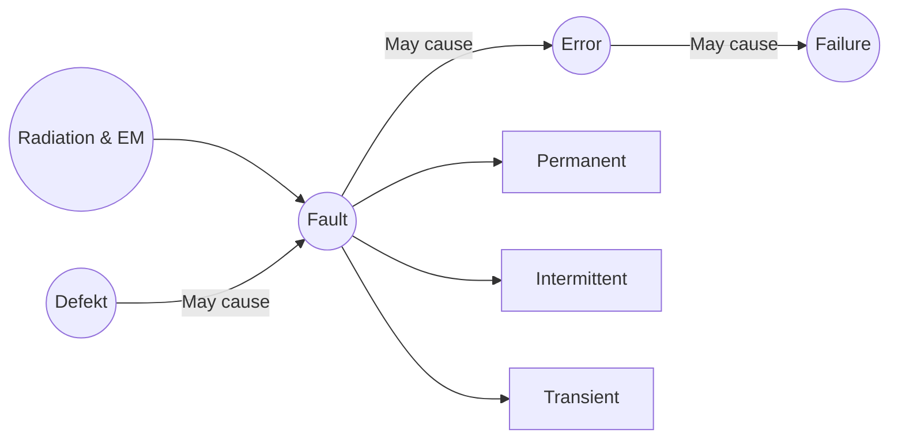
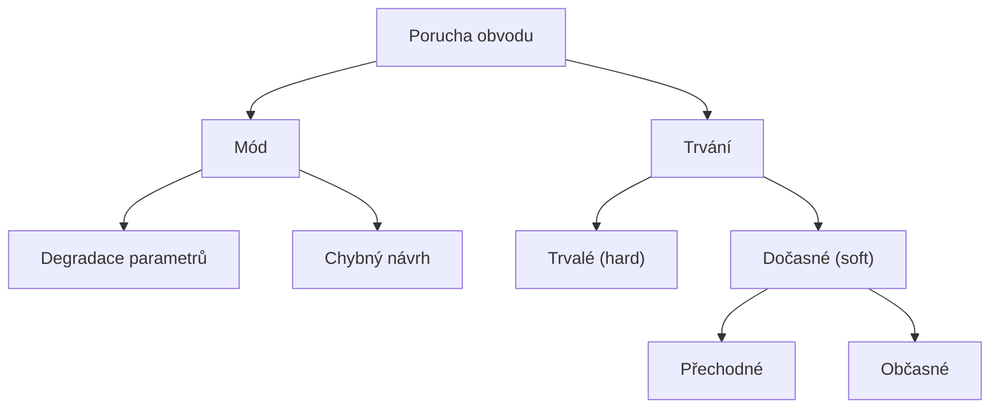

# Defekty a poruchy

## Defekt
DUT -> device under test

> [!tip] DPM
> Defects per milion

 > [!note] Požadujeme:
 > 0DPM - zero defects per milion 

> [!tip] Defekty se stávají, mohou se projevit:
>- porucha
>- zhoršení parametrů

Defekt není vždy porucha, ale některé se tak projeví.

> [!warning] Failure - Selhání
## Poruchy

latentní porucha - neodhalená

### Typy poruch
> [!example] Typy poruch:
>- Permanent - trvalé
>- Intermittent - občasné
>- Transient - přechodné

#### Hard failures
Trvalé poruchy (Hard failures):  
demonstrují se nezávisle na okamžiku testování, při všech frekvencích, pro demonstraci zpravidla stačí jeden testovací vzorek 
#### Soft failures
Dočasné poruchy (Soft failures):  
demonstrují se jen za specifických podmínek, způsobují změnu parametrů, např. zpoždění, pro jejich detekci je třeba více testovacích vzorků

- přechodné  (transient)
  vybuzeno vnějšími faktory – radiace, teplota, rušení po síti, rušení od sousedních prvků indukční nebo kapacitní vazbou, alfa částice ...
- občasné  (intermitent) 
  způsobeno vnitřní degradací parametrů, chybný signál se projeví jen při specifických podmínkách, časem se poruchy změní na trvalé

### Trvalé 0/1
- t0 - trvale v 0
- t1 - trvale v 1

### Zkraty
Typu:
- OR - s dominantní 1
- AND - s dominantní 0

Testujeme poruchy na vstupech, protože poruchy na výstupech jsou dominantní. 

Elektro-migrace:
- vyrostou zkraty
- zúžení cesty (větší odpor)

## Vlastnosti poruch

Mějme poruchy:  F1 a F2 s T1 a T2

> [!Tip] Ekvivalence: 
F1 je ekvivalentní F2 když T1 = T2
Každý test, detekující F1 detekuje i F2

> [!tip] Dominance:
F1 dominuje F2 když  T2 $\subseteq$ T1
test detekující F2 detekuje také F1
relace není symetrická