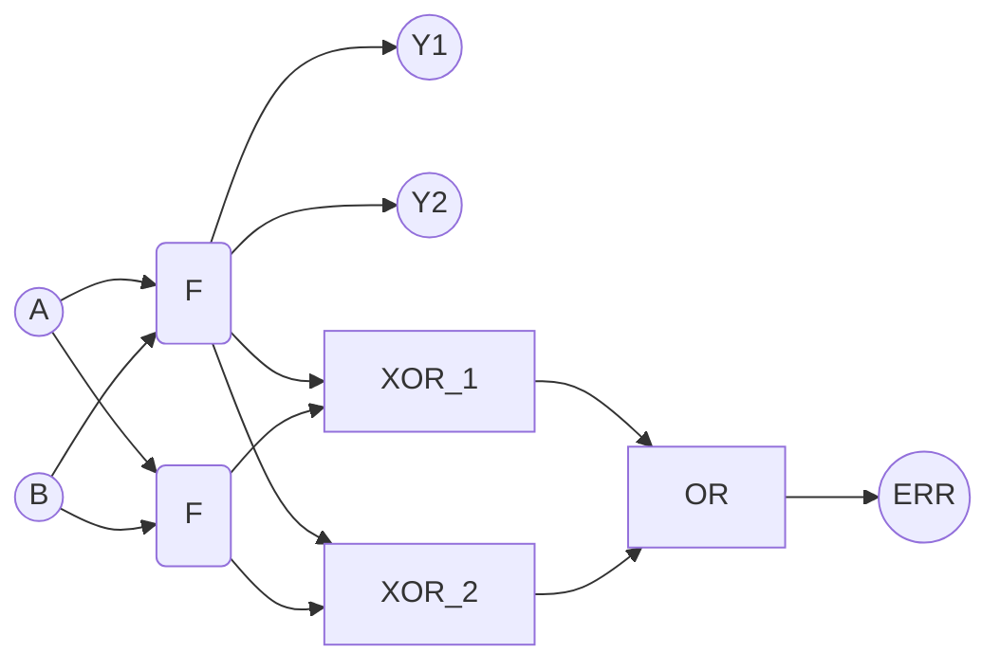
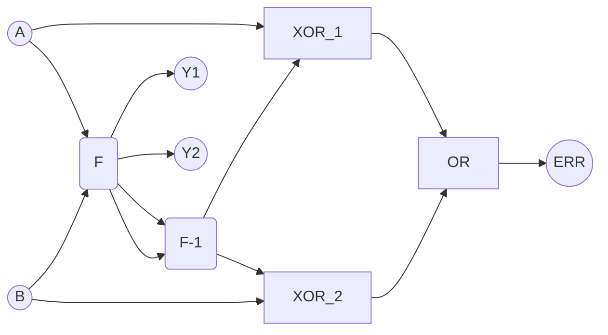

# Obvody bezpečné proti poruchám

![[TMR]]

Dopad radiace na paměť
SEUs - Single event upsets

> [!tip] Obvody bezpečné proti poruchám
Obvody je bezpečný pro jedno poruchy, jestliže pro každý vstupní vektor a poruchu platí že odezva je:
>- správná,
>- chybový stav.

Dostaneme stav chybu, nebo správný výsledek.
## Zdvojení logiky
### Dvakrát stejná funkce

### Funkce a její opak
F -> F-1

Jestliže obvod realizuje prosté zobrazení, je možné navrhnout obvod realizující inversní funkci.
Pravděpodobnost současného výskytu poruch v obou blocích je nízká.
### Dvoudrátová logika
Proto z 74xx má negované výstupy.

Vyhodnocujeme najednou přímou a negovanou větev.

Výhodné pro průběžnou kontrolu správnosti funkce i sekvenčních obvodů. Transitivita chyby v libovolně dlouhém řetězci logických členů. S prodlužováním řetězce ale vzrůstá pravděpodobnost výskytu vícenásobné chyby.

## Hlídací/záložní procesor
